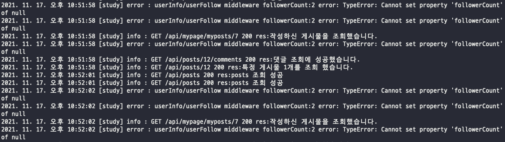

### 2021-11-17 refactoring

#### 1. DB RDS 분리

- config.js 파일 내 rds 추가
- 환경 변수 추가

```jsx
rds: {
    username: process.env.RDS_USER,
    password: process.env.RDS_PASSWORD,
    database: process.env.RDS_DB_NAME,
    host: process.env.RDS_END_POINT,
    dialect: "mysql",
  },
```

#### 2. 필터페이지 게시물 조회 검색 기능 추가

- 필터페이지 쿼리스트링 추가
- SQL query WHERE 절 조건에 검색 키워드 추가

```jsx
if (keyword)
  condition.push(`Post.title LIKE '%${encodeURIComponent(keyword)}%'`);
```

#### 3. winston file 시스템 적용

- logger console 처리 및 fs 시스템으로 저장
- 각 res 요청 전부 logger 처리 후 fs 시스템 저장 될 수 있도록 처리함.
- ec2 서버 winston 적용 했으나, 시간 설정이 잘 안됨.
- logger.js 파일 수정 부분

```jsx
const timezoned = () => {
  return new Date().toLocaleString("ko-KR", {
    timeZone: "Asia/Seoul",
  });
};

...

const printLogFormat = {
  file: combine(
    label({
      label: "study",
    }),
    timestamp({ format: timezoned }),
    printFormat
  ),
  console: combine(colorize(), simple()),
};
```

#### 4. 회원탈퇴 기능 수정

- 기존 삭제 방식 -> cascade 방식 적용
- 관계 형성 시 FK 삭제 오류 발생
- 관계 맺을 때 sourceKey에 onDelete: "cascade" 적용 시 FK로 등록된 key값만 지워짐

```jsx
db.User.hasMany(db.Post, {
  foreignKey: "userId",
  sourceKey: "userId",
  onDelete: "cascade",
});
```

- 아래 코드 처럼 적용시 targetKey에 해당 되는 모든 key 삭제 처리됨

```jsx
Post.belongsTo(db.User, {
  foreignKey: "userId",
  targetKey: "userId",
  onDelete: "cascade",
});
```

#### 5. 유저 정보 조회 페이지 -- 없는 유저의 정보를 조회 하려고 할때

- winston으로 error을 잡았다.



```jsx
error : userInfo/userFollow middleware followerCount:2 error: TypeError: Cannot set property 'followerCount' of null
```

- 확인 결과 user의 정보가 없을 경우 유효성 처리를 안해줘서 null 값을 그대로 가져다 쓸려고 하는 로직이 발견 되었다.
- 유효성 처리 후 정상 작동 됨.

```jsx
    if (!user) {
      message = "조회 하려는 사용자가 없습니다.";
      logger.info(`userInfo/userFollow middleware error: ${message}`);
      return res.status(400).send({ message });
```
