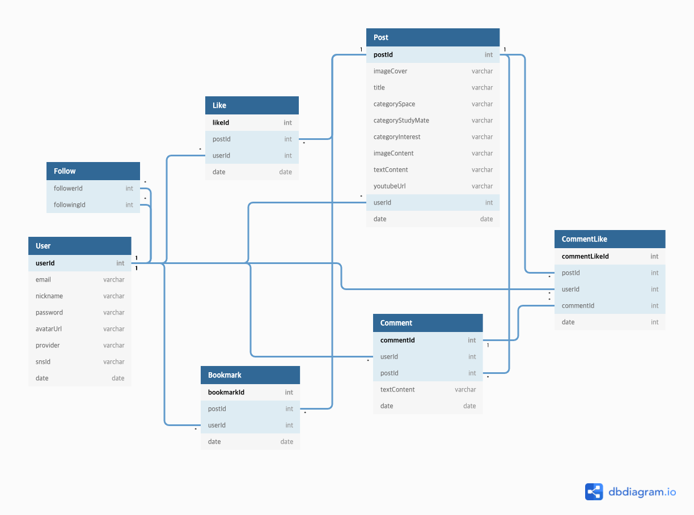

# 제목 없음

## Sequelize & MySQL

### 사용 목적

Sequelize를 이용하면 쿼리를 함수와 값으로 표현할 수 있어 텍스트로 쿼리를 직접 만드는 것 보다 코드를 작성하거나 읽기 더 쉬워지기 때문에 사용

Sequelize와 같은 ORM을 사용할 때 더 의미가 명확하기 때문에 사용

### dbdiagram.io



### 1. 모듈 설치

- Sequelize 모듈 설치

  ```jsx
  npm i sequelize mysql2 -S

  npm i sequelize-cli -D
  ```

- 사용준비
  ```jsx
  npx sequelize init
  ```

---

### 2. table 설정

### models/user.js

```jsx
"use strict";
const { Model } = require("sequelize");
module.exports = (sequelize, DataTypes) => {
  class User extends Model {
    /**
     * Helper method for defining associations.
     * This method is not a part of Sequelize lifecycle.
     * The `models/index` file will call this method automatically.
     */
    static associate(db) {
      db.User.hasMany(db.Post, {
        foreignKey: "userId",
        sourceKey: "userId",
      });
      db.User.hasMany(db.Comment, {
        foreignKey: "userId",
        sourceKey: "userId",
      });
      db.User.hasMany(db.Like, {
        foreignKey: "userId",
        sourceKey: "userId",
      });
      db.User.hasMany(db.Bookmark, {
        foreignKey: "userId",
        sourceKey: "userId",
      });
      db.User.hasMany(db.CommentLike, {
        foreignKey: "userId",
        sourceKey: "userId",
      });
      db.User.belongsToMany(db.User, {
        foreignKey: "followingId",
        as: "Followers",
        through: "Follow",
      });
      db.User.belongsToMany(db.User, {
        foreignKey: "followerId",
        as: "Followings",
        through: "Follow",
      });
    }
  }
  User.init(
    {
      userId: {
        allowNull: false,
        autoIncrement: true,
        primaryKey: true,
        type: DataTypes.INTEGER,
        unique: true,
      },
      email: {
        type: DataTypes.STRING(40),
        allowNull: true,
        unique: true,
      },
      nickname: {
        type: DataTypes.STRING(20),
        allowNull: false,
        unique: true,
      },
      password: {
        allowNull: true,
        type: DataTypes.STRING,
      },
      avatarUrl: {
        allowNull: true,
        type: DataTypes.STRING,
      },
      provider: {
        type: DataTypes.STRING(20),
        allowNull: false,
        defaultValue: "local",
      },
      snsId: {
        type: DataTypes.STRING(30),
        allowNull: true,
      },
      date: {
        allowNull: false,
        type: DataTypes.DATE,
      },
    },
    {
      sequelize,
      modelName: "User",
      timestamps: false,
      charset: "utf8",
      collate: "utf8_general_ci",
    }
  );
  return User;
};
```

**User.init**

- table의 key 설정

- timestamps : false로 설정함. sequelize 자체적으로 createAt, updateAt을 생성하는데 안쓰려고 했음.

**static associate**

- 1:N ⇒ Post, Comment, Like, Bookmark, CommentLike

- N:M ⇒ user.Followers, user.Followings

> #### 참고
>
> 다른 모든 테이블 user 테이블과 관계 형성함.
>
> [src/models](https://github.com/JangJaeWon22/focus-with-me/tree/main/src)

- db생성
  ```jsx
  npx sequelize db:create
  ```
