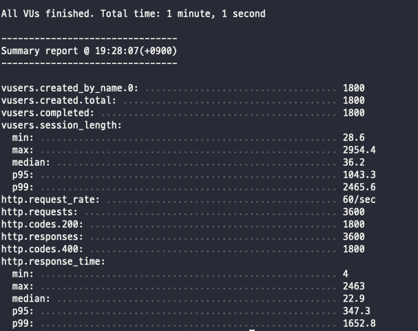

# TIL

## 서버 부화 테스트

#### 1. 모듈 선택

- artillery
  - Node js 에서 부화 테스트 모듈을 검색하면 처음으로 떴습니다.
  - 공룡을 만날 수 있습니다.

---

#### 2. 모듈 설치

```jsx
npm install artillery -D
```

---

#### 3. 설치 확인

```jsx
//공룡을 확인해보자
./node_modules/.bin/artillery dino
```

---

#### 4. 스크립트 작성

src/test.json

```jsx
{
    "config": {
        "target": "테스트할 서버 주소",
        "phases": [
            {
                "duration": 60,
                "arrivalRate": 30
            }
        ]
    },
    "scenarios": [
        {
            "flow": [
                {
                    "get": {
                        "url": "/api/posts"
                    }
                },
                {
                    "get": {
                        "url": "/api/posts/3/comments"
                    }
                }
            ]
        }
    ]
}
```

현재 테스트 api는 단위로 나눠서 해볼 생각이였습니다.

가장 걱정이 되는 로직인 부분을 2가지만 추려서 테스트 했습니다.

---

#### 5. 테스트 실행

```jsx
npx artillery run test.json
```

---

#### 6. 실행 결과



- 총 요청이 1800번 수행 후 성공
- 초당 60번 요청이 처리
- 총 url이 2개로 인해 status 값이 200, 400 으로 1800씩 뜸.
  - **로직의 문제를 발견 (예외 처리를 안해줌) ⇒ pagination이 없을 경우에 대한 처리가 안되어 있어서
    /api/posts/3/comments**의 주소가 400으로 뜸.
- 응답 지연 속도
  - 최소 4ms, 최대 2464ms 가 소요
  - 평균 지연 속도 22.9ms
  - p95(하위 95%) 값은 347.3ms
  - p99(하위 99%) 값은 1652.8ms

---

#### 7. 느낀점

- 작업을 1800명이 2개의 데이터베이스에 요청을 함으로 무리가 갈 수 있어 local에서 대부분 테스트를 진행(서버에서는 필요시에 작동될 수 있도록 작업을 진행)
- 속도 측면으로 p99의 속도를 줄일 필요가 있을 것으로 예상이 되며, 서버의 부화가 나타나도 버텨주는 서버를 만들어야 겠다는 생각을 함
