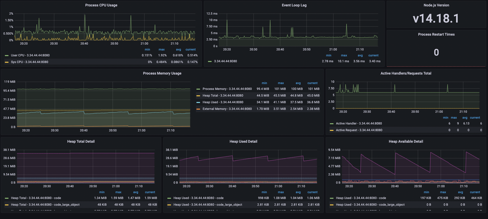

# 프로메테우스와 그라파나

### 1. ec2 docker 설치

```jsx
sudo apt update

// 필요한 util들을 설치해주도록 합니다.
sudo apt install apt-transport-https

sudo apt install ca-certificates

sudo apt install curl

sudo apt install software-properties-common

// docker 설치
curl -fsSL https://download.docker.com/linux/ubuntu/gpg | sudo apt-key add -

sudo add-apt-repository "deb [arch=amd64] https://download.docker.com/linux/ubuntu bionic stable"

sudo apt update

// apt list에 도커를 다운로드 받을 수 있는 경로가 추가가 되었으므로 도커를 진짜 다운로드
apt-cache policy docker-ce

// 다운로드가 완료되었으면 docker-ce를 설치하도록합니다.
sudo apt install docker-ce

// docker sudo 안쳐도 되게 하기
sudo usermod -a -G docker ec2-user
```

---

### 2. docker test

```jsx
// docker로 본격적인 웹서버 구동을 하기 전에 test image를 받아 한번 test
docker pull hello-world

docker run hello-world

// test를 마쳤으니 해당 container를 지워주도록 합니다.
docker ps -a

// image 지우기
docker images

docker rmi 지울_imagesID
```

---

### 3. docker-compose 설치

```jsx
// docker-compose 설치
sudo curl \
    -L "https://github.com/docker/compose/releases/download/1.26.2/docker-compose-$(uname -s)-$(uname -m)" \
    -o /usr/local/bin/docker-compose

// 바이너리에 실행 권한 주기
sudo chmod +x /usr/local/bin/docker-compose

// 설치 확인
docker-compose --version
```

---

### 4. 파일 생성 src/docker-compose.yml

```jsx
version: "3"

services:
  prometheus:
    container_name: prometheus
    image: prom/prometheus:latest
    command:
      - "--config.file=/etc/prometheus/prometheus.yml"
      - "--storage.tsdb.path=/prometheus"
      - "--web.console.libraries=/usr/share/prometheus/console_libraries"
      - "--web.console.templates=/usr/share/prometheus/consoles"
    volumes:
      - ./prometheus/prometheus.yml:/etc/prometheus/prometheus.yml
    ports:
      - 9090:9090

  grafana:
    container_name: grafana
    image: grafana/grafana:latest
    ports:
      - "3000:3000"
    volumes:
      - ./grafana/datasource.yml:/etc/grafana/provisioning/datasources/datasource.yml
    environment:
      - GF_AUTH_ANONYMOUS_ENABLED=true
      - GF_AUTH_ANONYMOUS_ORG_ROLE=Admin
```

docker-compose 로 사용 할 prometheus와 grafana 를 설정

---

### 5. 파일 생성 src/prometheus/prometheus.yml

```jsx
# my global config
global:
  scrape_interval: 15s # By default, scrape targets every 15 seconds.
  evaluation_interval: 15s # By default, scrape targets every 15 seconds.

  external_labels:
    monitor: "my-project"

rule_files:
  # - 'alert.rules'
  # - "first.rules"
  # - "second.rules"

# alert
# alerting:
#   alertmanagers:
#   - scheme: http
#     static_configs:
#     - targets:
#       - "alertmanager:9093"

# A scrape configuration containing exactly one endpoint to scrape:
# Here it's Prometheus itself.
scrape_configs:
  - job_name: "prometheus"
    scrape_interval: 5s

    static_configs:
      - targets: ["3.34.44.44:8080"]

	# test 과정 중 node-exporter도 사용 했으나, docker의 container에서 자꾸 격리를 시키려고 하기에 사용을 안하는걸 추천 하여 일단 주석 처리함
  # - job_name: "node-exporter"
  #   scrape_interval: 5s

  #   static_configs:
  #     - targets: ["node-exporter:9100"]
```

test 과정 중 node-exporter도 사용 했으나, docker의 container에서 자꾸 격리를 시키려고 하기에 사용을 안하는걸 추천 하여 일단 주석 처리함

---

### 6. 파일 생성 src/grafana/datasource.yml

```jsx
apiVersion: 1

deleteDatasources:
  - name: Prometheus

datasources:
  - name: Prometheus
    type: prometheus
    access: proxy
    orgId: 1
    url: http://prometheus:9090
    basicAuth: false
    isDefault: false
    version: 1
    editable: false
```

---

### 7. 실행 해보자!!

```jsx
// ec2 배포 후 서버 실행 시키고 docker 배를 띄우자

docker-compose up -d prometheus

docker-compose up -d grafana
```

"-d" 를 추가하면 백그라운드에서 계속 실행 시킴

---

### 8. grafana의 open dashboard 를 사용

- [Nodejs Metrics](https://grafana.com/grafana/dashboards/11956)
- [NodeJS Application Dashboard](https://grafana.com/grafana/dashboards/11159)

---

### 9. 실행 결과



---

### 10. 느낀 점

- 추후 위 그래프로 인해 발생되는 트래픽을 수정하고 관리 할 예정
- 트래픽을 눈으로 볼 수 있음으로 높게 튄 구간을 winston 을 활용해 트래픽을 줄이는게 목표
