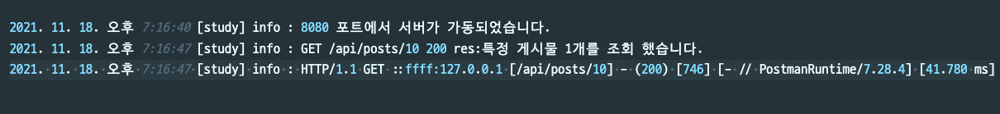
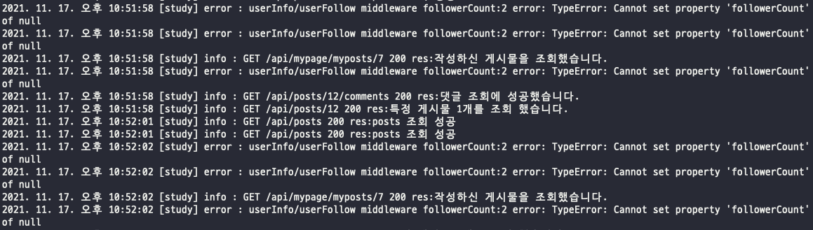

# TIL

## winston and morgan

### 1. 모듈 설치

```jsx
npm install winston winston-daily-rotate-file morgan
```

---

### 2. /src/config/logger.js

```jsx
const { createLogger, transports, format } = require("winston");
const winstonDaily = require("winston-daily-rotate-file");
const { label, combine, timestamp, printf, simple, colorize } = format;

const timezoned = () => {
  return new Date().toLocaleString("ko-KR", {
    timeZone: "Asia/Seoul",
  });
};

const printFormat = printf(({ timestamp, label, level, message }) => {
  return `${timestamp} [${label}] ${level} : ${message}`;
});

const printLogFormat = {
  file: combine(
    label({
      label: "study",
    }),
    timestamp({ format: timezoned }),
    printFormat
  ),
  console: combine(colorize(), simple()),
};

const opts = {
  file: new winstonDaily({
    filename: `%DATE%.log`,
    dirname: "./logs",
    level: "info",
    format: printLogFormat.file,
  }),
  console: new transports.Console({
    level: "info",
    format: printLogFormat.console,
  }),
};

const logger = createLogger({
  transports: [opts.file],
});

if (process.env.NODE_ENV !== "production") {
  logger.add(opts.console);
}

const stream = {
  write: (message) => {
    logger.info(message);
  },
};

module.exports = { logger, stream };
```

- winston-daily-rotate-file 을 통해 매일매일 logger를 저장 할 계획
- 원인을 알 수 없으나, ec2 환경에서는 timestamp가 정상적으로 작동 되지 않아서 timezoned라는 function으로 시간 처리

---

### 3. server.js

```jsx
const { stream } = require("./config/logger");
app.use(
  logger(
    `HTTP/:http-version :method :remote-addr [:url] :remote-user (:status) [:res[content-length]] [:referrer // :user-agent] [:response-time ms] `,
    { stream }
  )
);
```

morgan에 winston을 합쳐서 전부 저장

---

### 4. winston logger 파일 저장 부분 코드 추가

```jsx
const { logger } = require("../config/logger");
const logger = require("morgan");

getPosts: async (req, res) => {
    //조회는 미들웨어에서 처리하고, 여기는 던지는 역할만 하기
    const { randPosts, posts, totalPage } = req;
    const followPost = res.followPost;
    message = "posts 조회 성공";
    logger.info(`GET /api/posts 200 res:${message}`);
    return res.status(200).send({
      message,
      posts,
      randPosts,
      followPost,
      totalPage,
    });
  },
```

위 예시와 같이 다른 모든 res 에 logger를 추가해서 기록

---

### 7. 파일 시스템에 저장 된 logger 확인



---

### 8. 문제점

- 한줄에 모든 것을 포함 하는 방법도 있으나, 보기 불편할 듯하여 winston logger 와 morgan logger를 같이 수집.
- 어떤 api요청으로 message가 표현하는것을 winston으로만 처리가 되고 morgan에는 적용이 되지 않는다.

---

### 9. winston을 통해 문제를 찾아 해결 함.



```jsx
error : userInfo/userFollow middleware followerCount:2 error: TypeError: Cannot set property 'followerCount' of null
```

- 확인 결과 user의 정보가 없을 경우 유효성 처리를 안해줘서 null 값을 그대로 가져다 쓸려고 하는 로직이 발견 되었다.
- 유효성 처리 후 정상 작동 됨.

```jsx
    if (!user) {
      message = "조회 하려는 사용자가 없습니다.";
      logger.info(`userInfo/userFollow middleware error: ${message}`);
      return res.status(400).send({ message });
```

### 10. 느낀점

- 로그를 저장하는 것은 선택이 아닌 필수로 느껴질 만큼 프로그램의 안정성에 중요한 부분인 것 같음.
- 로그를 도입하고 하루도 안되어서 미쳐 발견하지 못한 예외처리 에러를 처리 할 수 있게 되어서 다행이라고 생각되고, 앞으로도 항상 로그를 써야겠다고 느낌.
- 단, 로그를 저장하고 확인하는 작업에서 끝나는게 아니라, 파일을 자주 확인하여 미쳐 생각지 못한 트러블슈팅을 관리 해야겠다고 생각 했음.
